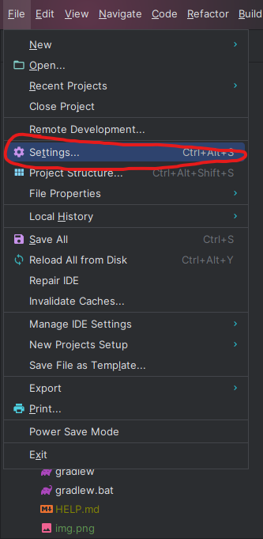
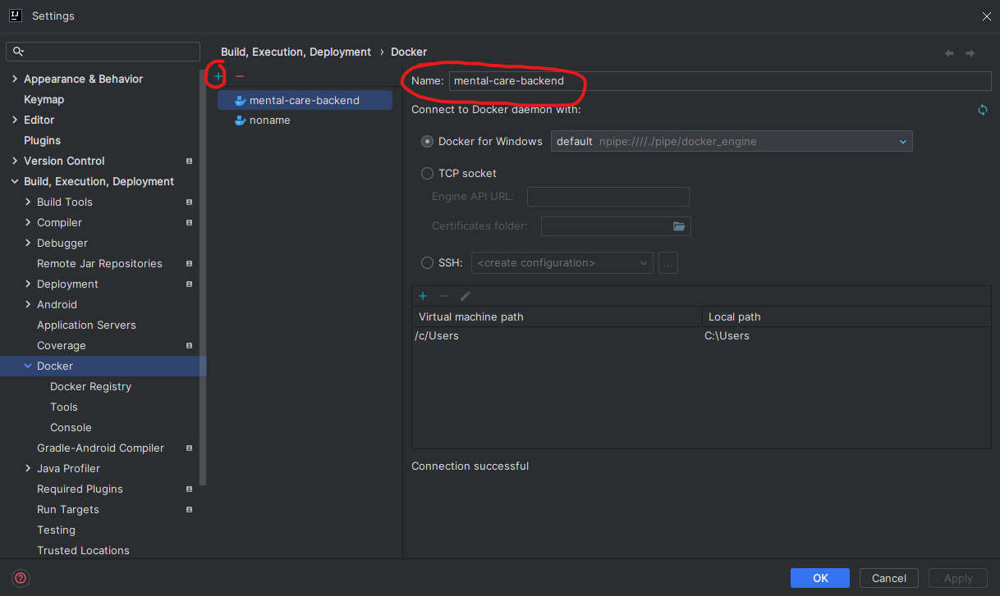
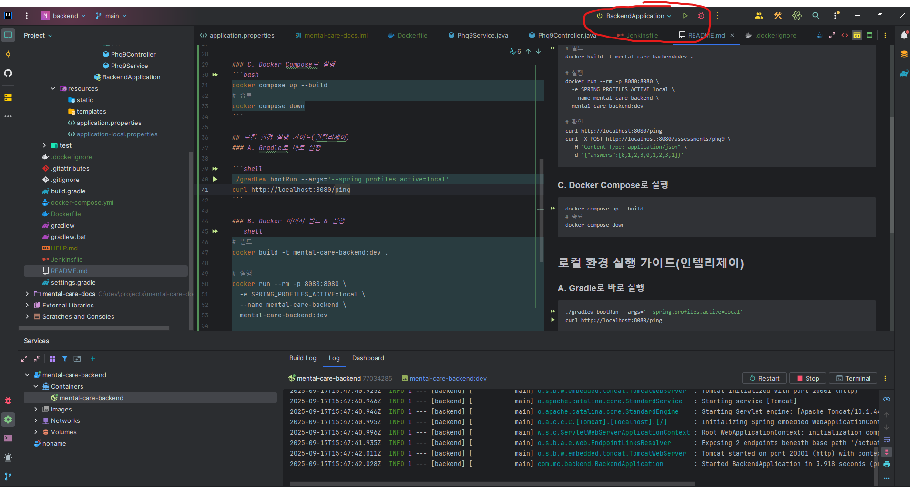
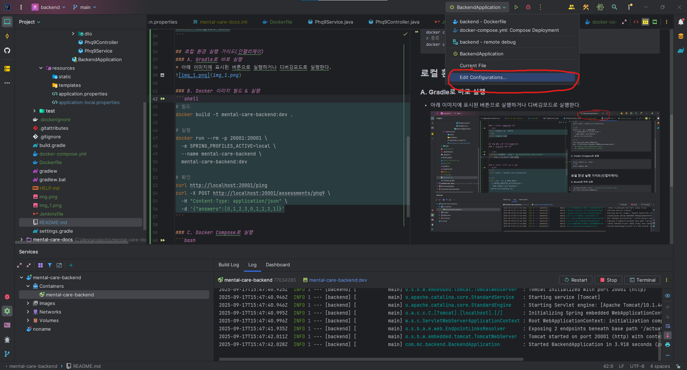
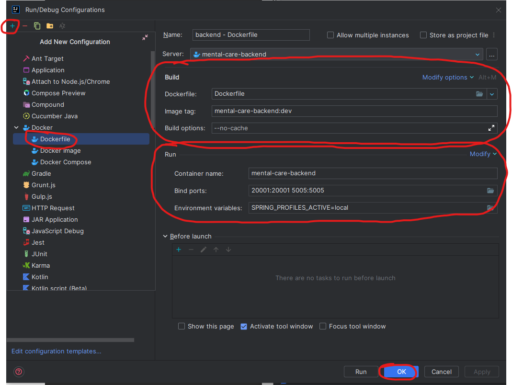
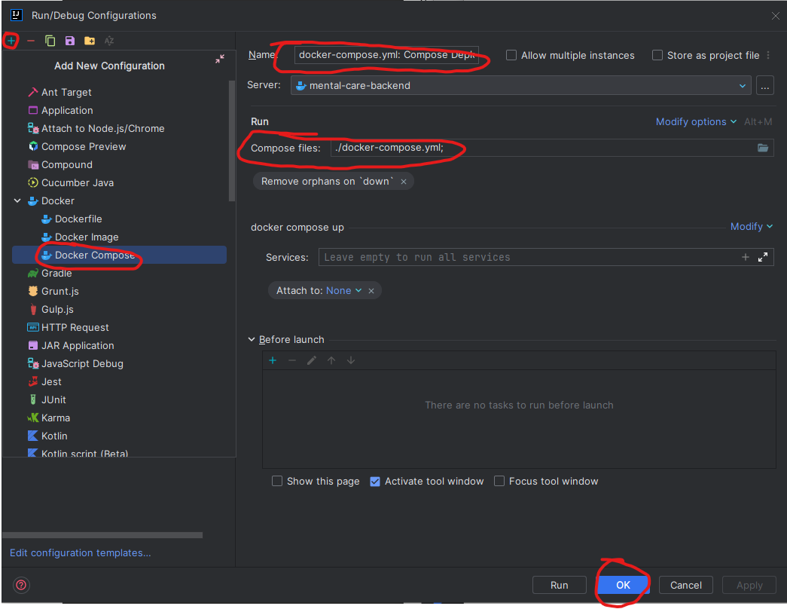

# Mental Care Backend

## 로컬 환경 실행 가이드(커맨드)
### A. Gradle로 바로 실행

```shell
./gradlew bootRun --args='--spring.profiles.active=local'
curl http://localhost:20001/ping
```

### B. Docker 이미지 빌드 & 실행
```shell
# 빌드
docker build -t mental-care-backend:dev .

# 실행
docker run --rm -p 20001:20001 \
  -e SPRING_PROFILES_ACTIVE=local \
  --name mental-care-backend \
  mental-care-backend:dev

# 확인
curl http://localhost:20001/ping
curl -X POST http://localhost:20001/assessments/phq9 \
  -H "Content-Type: application/json" \
  -d '{"answers":[0,1,2,3,0,1,2,3,1]}'
```

### C. Docker Compose로 실행
```bash
docker compose up --build
# 종료
docker compose down
```

## 로컬 환경 실행 가이드(인텔리제이)
### 0. Docker 설정(최초 1회)
1. Docker 설치 후, file -> settings 창 열기


2. +버튼으로 추가후 이름 변경 후 OK버튼 클릭


### A. Gradle로 바로 실행
* 아래 이미지에 표시된 버튼으로 실행하거나 디버깅모드로 실행한다.


### B. Docker 이미지 빌드 & 실행
1. 우측 상단 아이콘 클릭 -> Edit Configurations


2. 좌측 상단 +버튼 클릭 -> DockerFile 클릭 -> 우측 항목 입력(항목없을시 modify options에서 항목 추가) 후 OK 버튼 클릭


### C. Docker Compose로 실행
1. 좌측 상단 +버튼 클릭 -> Docker Compose 클릭 -> 우측 항목 입력(항목없을시 modify options에서 항목 추가) 후 OK 버튼 클릭
